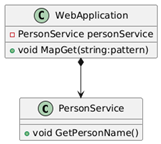
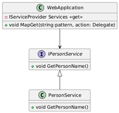
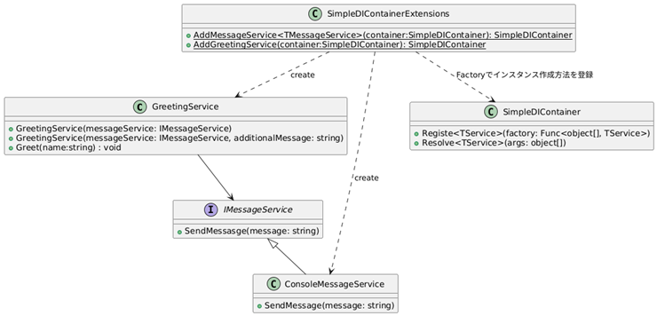

# 依存性の注入

## 通常の依存状態


```cs
class ConsoleLogger
{
    public void LogTrace(string s) => Console.WriteLine($"[Trace]:{s}");
    public void LogDebug(string s) => Console.WriteLine($"[Debug]:{s}");
    public void LogInfo(string s) => Console.WriteLine($"[Info]:{s}");
    public void LogWarning(string s) => Console.WriteLine($"[Warn]:{s}");
    public void LogError(string s) => Console.WriteLine($"[Error]:{s}");
}

class Messenger
{
    private ConsoleLogger _logger = new();
    private string _message;
    public string SetMessage(string message)
    {
        logger.LogDebug("set: " + message);
        _message = message;
    }

    public string GetMessage()
    {
        logger.LogDebug("get: " + _message);
        return _message
    }
}
```


## 抽象（Interface）に依存している状態


```cs
class FileLogger : Disposable
{
    private StreamWriter _writer;
    public FileLogger(string path)
    {
        _writer = new StreamWriter(path);
    }
    public void LogTrace(string s) => _writer.WriteLine($"[Trace]:{s}");
    public void LogDebug(string s) => _writer.WriteLine($"[Debug]:{s}");
    public void LogInfo(string s) => _writer.WriteLine($"[Info]:{s}");
    public void LogWarning(string s) => _writer.WriteLine($"[Warn]:{s}");
    public void LogError(string s) => _writer.WriteLine($"[Error]:{s}");
    public Dispose()
    {
        _writer.Dispose();
    }
}

interface ILogger
{
    void LogTrace(string s);
    void LogDebug(string s);
    void LogInfo(string s);
    void LogWarning(string s);
    void LogError(string s);
}

class Messenger(ILogger logger)
{
    private ConsoleLogger _logger = logger;
    private string _message;
    public string SetMessage(string message)
    {
        _logger.LogDebug("set: " + message);
        _message = message;
    }

    public string GetMessage()
    {
        _logger.LogDebug("get: " + _message);
        return _message
    }
}
```


## Asp.NET Coreでの依存性注入
https://learn.microsoft.com/ja-jp/training/modules/configure-dependency-injection/

- WebApplicationはPersonServiceに依存している
  


- WebApplicationはインターフェースIPersonServiceに依存している
- PresonServiceもインターフェースPersonServiceに依存している
  



```cs
var builder = WebApplication.CreateBuilder(args);
builder.Services.AddSingleton<IPersonService, PersonService>();

var app = builder.Build();
app.MapGet(
    pattern: "/", 
    //handler type: Func<IPersonService, string>
    handler: (IPersonService personService) =>
    {
        return $"Hello, {personService.GetPersonName()}!";
    });

app.Run();


interface IPersonService 
{
    void GetPersonName();
}
class PersonService(string Name) : IPersonService
{
    public void GetPersonName()
    {
        return Name;
    }
}

class WebApplication 
{
    private IServiceCollection services;
    private Dictionary<string,Delegate> actions = new();
    
    public void MapGet(string: pattern, Delegate handler)
    {
        actions.Add(pattern, handler);
    }

    public string Get(string pattern)
    {
        if(actions.TryGetValue(pattern, out ver hander))
        {
            // Reflectionでhandlerの引数の型を取得
            var pType = handler.Method.GetParameters().First().ParameterType;
            // その型のインスタンスをservicesから取得する
            var serviceInstance = services.Get(pType); 
            
            //取得したインスタンスをhandlerに渡して実行
            return handler(serviceInstance);
        }
    }
}
```

## DIコンテナの簡易実装

サンプルコード: [Program.cs](./Program.cs)



